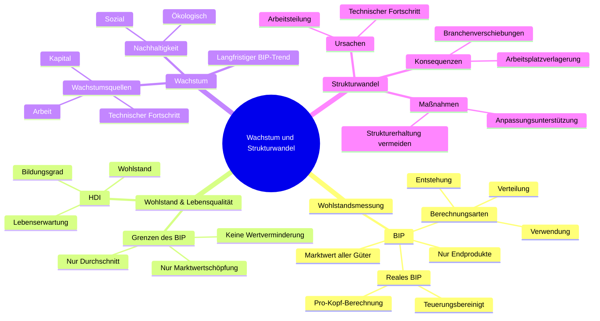

# kap 1o

# Begriffe

|Begriff|Definition|
|-------|----------|
|BIP    |Umfasst Marktwert aller wirtschaftlichen Güter, nur endprodukte werden berückischtigt für keine doppel zählungen|
|BIP zur teuerung korriegiert |reales BIP|
|BIP pro Kopf| Für intern. Vergleich Menschen / BIP|
|Berechung BIP| Wertschöpfung + Vorleistung( vorheriger Wertschäöpfung|
|Drei Arten BIP zu berechnen|via Entstehung, Verwendung oder Verteilung|
|BIP via Entstehung|Fokus auf die Wertschöpfung von Produktion|
|BIP via Verwendung|mist Betrag den Endverbraucher dafür Zahlen|
|BIP via Verteilung| Misst die Einkommen von allen drei Wertschöpfungsstufen|
|Grenzen des BIP| misst nor die Wertschöpfung vom Markt, beachtet Wertminderung nicht, zwift nur den durchschnittlichen Wohlstand|
|

**Noch ein Paar Coole Bilder**

