# kap 1o

```mermaid
mindmap
  root((Wachstum und Strukturwandel))
    Wohlstandsmessung
        BIP
            Marktwert aller Güter
            Nur Endprodukte
            Berechnungsarten
                Entstehung
                Verwendung
                Verteilung
            Reales BIP
                Teuerungsbereinigt
                Pro-Kopf-Berechnung
    Wohlstand & Lebensqualität
        Grenzen des BIP
            Nur Marktwertschöpfung
            Keine Wertverminderung
            Nur Durchschnitt
        HDI
            Wohlstand
            Lebenserwartung
            Bildungsgrad
    Wachstum
        Langfristiger BIP-Trend
        Wachstumsquellen
            Arbeit
            Kapital
            Technischer Fortschritt
        Nachhaltigkeit
            Ökologisch
            Sozial
    Strukturwandel
        Ursachen
            Technischer Fortschritt
            Arbeitsteilung
        Konsequenzen
            Branchenverschiebungen
            Arbeitsplatzverlagerung
        Maßnahmen
            Strukturerhaltung vermeiden
            Anpassungsunterstützung
```

# Begriffe

|Begriff|Definition|
|-------|----------|
|BIP|Umfasst Marktwert aller wirtschaftlichen Güter, nur endprodukte werden berückischtigt für keine doppel zählungen|
|BIP zur teuerung korriegiert |reales BIP|
|BIP pro Kopf| Für intern. Vergleich Menschen / BIP|
|Berechung BIP| Wertschöpfung + Vorleistung( vorheriger Wertschäöpfung|
|Drei Arten BIP zu berechnen|via Entstehung, Verwendung oder Verteilung|
|BIP via Entstehung|Fokus auf die Wertschöpfung von Produktion|
|BIP via Verwendung|mist Betrag den Endverbraucher dafür Zahlen|
|BIP via Verteilung| Misst die Einkommen von allen drei Wertschöpfungsstufen|
|Grenzen des BIP| misst nor die Wertschöpfung vom Markt, beachtet Wertminderung nicht, zwift nur den durchschnittlichen Wohlstand|
|Lebensqualität|Neben Wohlstand auch *Gesundheit, Freiheit, Bildung, Rechtssicherheit, Lebenserwartung, Bildungsgrat* lässt sich aber nicht messen|
|Human Development Index|Lebensqualität wird im HDI gemessen|
|Pro Kontra BIP und HDI|Gewichtung und Berreiche des HDI sind sehr umstritten und da BIp auch an Lebenserwartung und anderen Faktoren hängt ist BIP **SÜPER**|
|Wachstum|Wachstum = langfristiger Trend von BIP|
|Unterschied bei Wachstum|kleine unterschied machen lange grosse Unterschiede wie beim Zinseszins effekt|
|Gutes vom Wachstum|langfristiges Proportionales Wachstum ==> übderproprtionaler Zunahme vom BIP|
|Quellen von Wachstum|basiert nur auf technischem Fortschritt da Arbeit und Kapital knapp, deswegen ist grosse Innovation für BIP sehr gut|
|Nachhaltiges Wachstum 🌱|Wachstum nur wirklich positiv wenn ökologisch und sozial|
|Ökologisch nachhaltiges Wachstum|Nicht mehr Ressourcen werden verbraucht als zukünftig wieder verfügbar sind|
|Sozial nachhaltiges Wachstum|Wachstum geht nich auf kosten von der Bevölkerung|
|Struckturwandel|Technischer Fortschritt und laufend stärkere Arbeitsteilung *Bsp.: Roboter, AI usw.*|
|Folgen des Struckturwandel|Niedergang von Brache, Arbeitsplätze gehen verloren|
|Struckturerhaltung|Versuch den Strukturwandel aufzuschieben|
|Strukturbruch|Folgen von Strukturerhaltung, da sprunghafter Anstieg von Arbeitslosigkeit|
|Strukturwandel ist unabdingbar|Der Struckturwandel passiert immer, deswegen lieber einfach passieren lassen und Opfer Unterstützen|

**Noch ein Paar Coole Bilder**

*Strukturwandel in der Schweiz*

