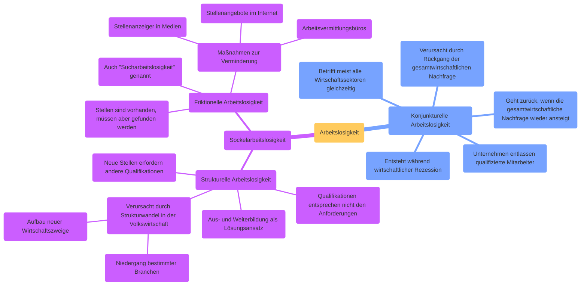

```mermaid
%%{init: {'theme': 'base', 'themeVariables': {'background': '#ffffff'}}}%%
mindmap
  root(Arbeitslosigkeit)
    1(Sockelarbeitslosigkeit)
      1.1(Strukturelle Arbeitslosigkeit)
        1.1.1(Qualifikationen entsprechen nicht den Anforderungen)
        1.1.2(Verursacht durch Strukturwandel in der Volkswirtschaft)
          1.1.2.1(Niedergang bestimmter Branchen)
          1.1.2.2(Aufbau neuer Wirtschaftszweige)
        1.1.3(Neue Stellen erfordern andere Qualifikationen)
        1.1.4(Aus- und Weiterbildung als Lösungsansatz)
      1.2(Friktionelle Arbeitslosigkeit)
        1.2.1(Stellen sind vorhanden, müssen aber gefunden werden)
        1.2.2(Auch "Sucharbeitslosigkeit" genannt)
        1.2.3(Maßnahmen zur Verminderung)
          1.2.3.1(Stellenanzeiger in Medien)
          1.2.3.2(Stellenangebote im Internet)
          1.2.3.3(Arbeitsvermittlungsbüros)
    2(Konjunkturelle Arbeitslosigkeit)
      2.1(Entsteht während wirtschaftlicher Rezession)
      2.2(Verursacht durch Rückgang der gesamtwirtschaftlichen Nachfrage)
      2.3(Betrifft meist alle Wirtschaftssektoren gleichzeitig)
      2.4(Unternehmen entlassen qualifizierte Mitarbeiter)
      2.5(Geht zurück, wenn die gesamtwirtschaftliche Nachfrage wieder ansteigt)
```
