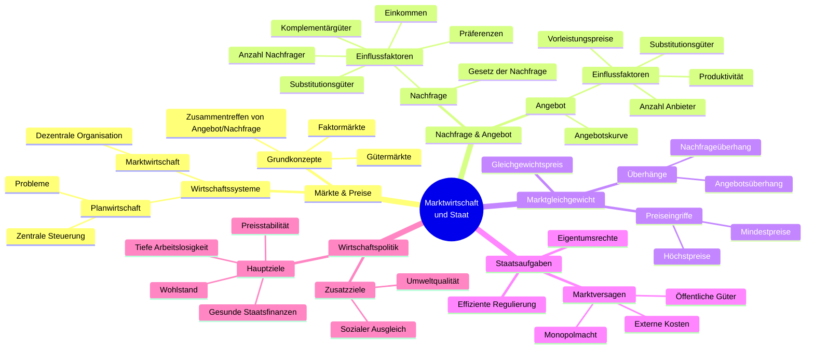

# kap 9

# Begriffe

|Begriff|Definition|
|-------|----------|
|Markt|Zusammentreffen von Angebot und Nachfrage für Tausch von Geld gegen Waren|
|Marktwirtschaft|Dezentrales System, freie Preise, privates Eigentum|
|Planwirtschaft|Zentrale Steuerung durch Staat, Problem: zu viele Infos & kleine Leistungsanreize|
|Nachfrage|Je höher Preis, desto weniger Nachfrage|
|Substitutionsgüter|Güter, die man austauschen kann, beeinflussen Nachfrage|
|Komplementärgüter|Güter, die zusammen genutzt werden *Bsp.: Drucker und Tinte*|
|Angebot|Je höher Preis, desto mehr Angebot|
|Marktgleichgewicht|Angebot = Nachfrage, Markt ist geräumt|
|Angebotsüberhang|Zu viel Angebot, Preis zu hoch|
|Nachfrageüberhang|Zu viel Nachfrage, Preis zu tief|
|Höchstpreis|Staat setzt max. Preis fest → führt zu Nachfrageüberhang|
|Mindestpreis|Staat setzt min. Preis fest → führt zu Angebotsüberhang|
|Externe Kosten|Kosten die andere tragen müssen *Bsp.: Umweltverschmutzung*|
|Monopolmacht|Nur ein Anbieter, kann Preis bestimmen|
|Öffentliche Güter|Niemand kann von Nutzung ausgeschlossen werden *Bsp.: Feuerwerk*|
|Wirtschaftspolitische Ziele|Hoher Wohlstand, tiefe Arbeitslosigkeit, stabile Preise, gesunde Staatsfinanzen|
|Zielkonflikte|Kurzfristig ja, langfristig nein|
|Zusatzziele|Umweltqualität und sozialer Ausgleich, schwer zu definieren|
